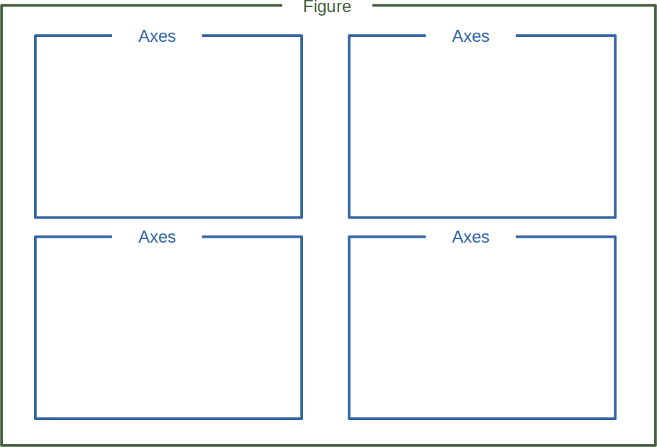
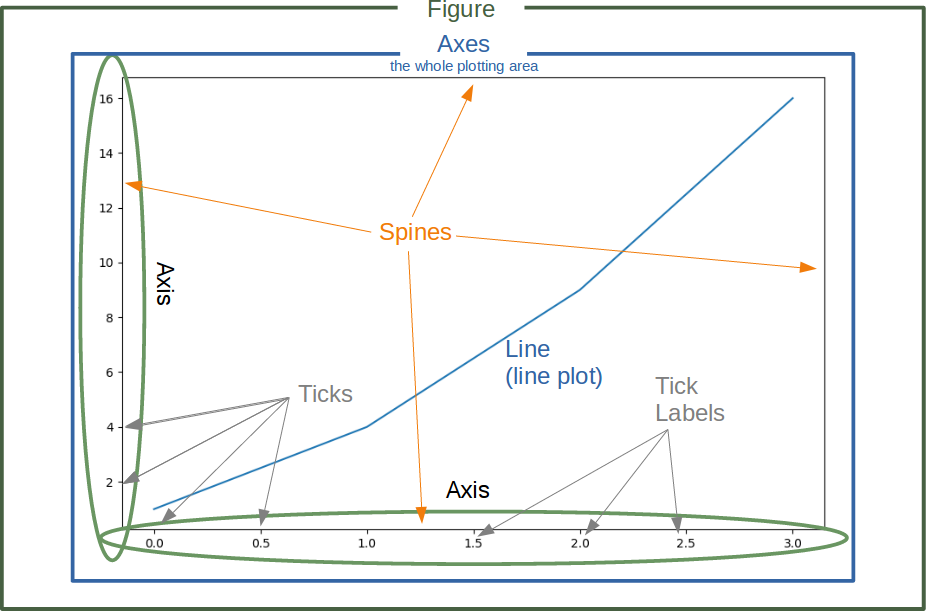
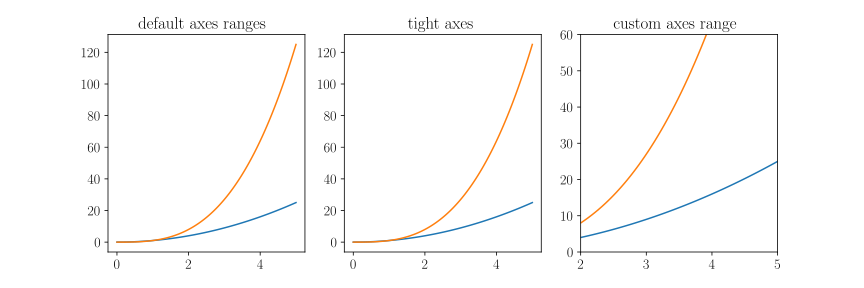
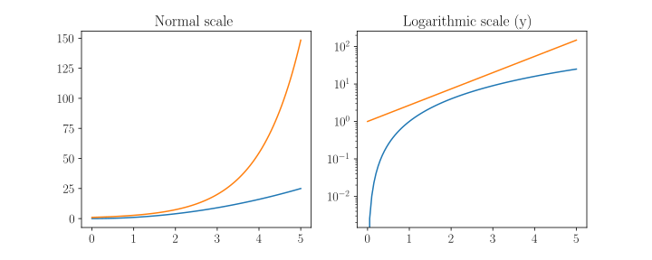
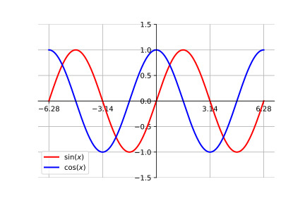
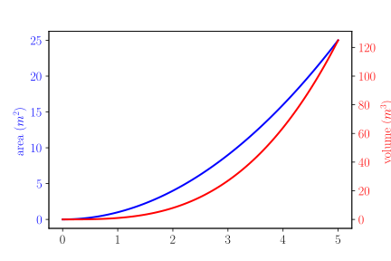
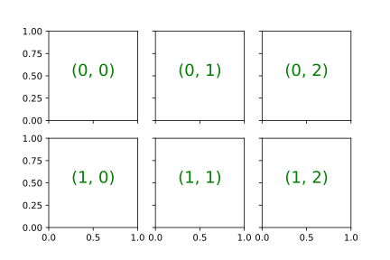
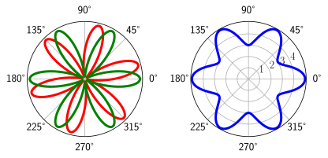
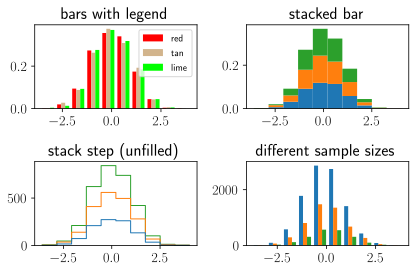

# Introduction

For all the code snippets presented in this document, we assume the following
modules have been imported.

```python
import matplotlib.pyplot as plt
import numpy as np
```

## OO Interface vs PyPlot Interface

There are two approaches when using `matplotlib`:

- `pyplot` interface
- Object-Oriented (OO) interface

### PyPlot Interface

The `pyplot` interface is made to imitate MATLAB's method of generating plots.
All the `pyplot` commands make changes and modify the same figure, allowing us
to quickly and easily generate plots. However, it has limitations when it comes
to making intricate plots. As a result, the OO approach will be used throughout
this document.

An example using the `pyplot` interface is given below.

```python
# data points
x = np.linspace(0, 2, 20)
y = x ** 2

# plot two functions on the same figure
plt.plot(x, y, 'bo-')
plt.plot(y, x, 'ro-')

# figure properties
plt.xlabel('x')
plt.ylabel('y')
plt.title('title')
plt.legend(["x^2", "sqrt(x)"])
plt.ylim(0, 3)
plt.grid(True)
```


## Object-Oriented Interface

**Matplotlib** is hierarchically organized. The top of the tree-like structure
of matplotlib objects is the `figure` object. A figure can be seen as the
container which contains one or more **plots**. The plots are called `axes` in
matplotlib. The following diagram shows a `figure` with four `axes`:



Similar important terms include `Axis`, `Tick`, and `Spine`. Their function and
meaning are easy to grasp by looking at the figure below:



### Simple Plots

A simple plot created with the OO interface is shown below.

```python
# create an empty figure object with no axes
fig = plt.figure()

# add a new axes instance to the figure using the add_axes method
ax = fig.add_axes([0.1, 0.1, 0.8, 0.8]) # left, bottom, width, height

# data points
x = np.linspace(0, 5, 10)
y = x ** 2

# plot function
ax.plot(x, y, 'r')

# plot properties
ax.set_xlabel('x')
ax.set_ylabel('y')
ax.set_title('title')

plt.show()
```


We can easily add more than one `axes` to the figure and control where they are
placed.

```python
fig = plt.figure()

ax1 = fig.add_axes([0.1, 0.1, 0.8, 0.8]) # main axes
ax2 = fig.add_axes([0.2, 0.5, 0.4, 0.3]) # inside axes

# data points
x = np.linspace(0, 5, 10)
y = x ** 2

# main axes
ax1.plot(x, y, 'r')
ax1.set_xlabel('x')
ax1.set_ylabel('y')
ax1.set_title('main axes')

# inside axes
ax2.plot(y, x, 'g')
ax2.set_xlabel('y')
ax2.set_ylabel('x')
ax2.set_title('inside axes')
```


If we don't care about the precise locations where the `axes` are placed in the
`figure` canvas, then we can use one of the many `axes` layout managers in
`matplotlib`. One of them is `subplots`, which can be used like this:

```python
days = np.arange(1, 9)
celsius_min = [19.6, 24.1, 26.7, 28.3, 27.5, 30.5, 32.8, 33.1]
celsius_max = [24.8, 28.9, 31.3, 33.0, 34.9, 35.6, 38.4, 39.2]

# subplots(nrows=1, ncols=1)
fig, ax = plt.subplots()

ax.set(xlabel="Day",
       ylabel="Temperature in Celcius",
       title ="Temperature graph")

ax.plot(days, celsius_min)
ax.plot(days, celsius_min, "oy")
ax.plot(days, celsius_max)
ax.plot(days, celsius_max, "or")

xmin, xmax, ymin, ymax = 0, 10, 14, 45
ax.axis([xmin, xmax, ymin, ymax])
```


## Saving figures

To save a figure to a file, we can use the `savefig` method in the `figure`
class:

```python
fig.savefig("filename.png")
```

Here, we can also optionally specify the `DPI` and choose between different
output formats (PNG, JPG, EPS, SVG, PGF and PDF):

```python
fig.savefig("filename.png", dpi=200)
```

# Figure Properties

Matplotlib allows the **aspect ratio**, **DPI** and **figure size** to be
specified when the `figure` object is created, using the `figsize` and `dpi`
keyword arguments.  `figsize` is a tuple of the width and height of the figure
in **inches**, and `dpi` is the dots-per-inch (pixel per inch). To create an
800x400 pixel, 100 dots-per-inch figure, we can do:

```python
fig = plt.figure(figsize=(8,4), dpi=100)
```

The same arguments can also be passed to layout managers, such as the
`subplots` function:

```python
fig, axes = plt.subplots(figsize=(12,3))
```

## Legends, labels, and titles

### Legends

Legends for curves in a figure can be added in two ways. One method is to use
the `legend` method of the axis object and pass a list/tuple of legend texts
for the previously defined curves:

```python
ax.legend(["curve1", "curve2", "curve3"])
```

This method is somewhat prone to errors and unflexible if curves are added to
or removed from the figure (resulting in a wrongly labelled curve).

A better method is to use the `label="label text"` keyword argument when plots
or other objects are added to the figure, and then using the legend method
without arguments to add the legend to the figure.

```python
ax.plot(x, x**2, label="curve1")
ax.plot(x, x**3, label="curve2")
ax.legend()
```

The advantage of this method is that if curves are added or removed from the
figure, the legend is automatically updated accordingly.

The legend function takes an optional keyword argument `loc` that can be used
to specify where in the figure the legend is to be drawn. The allowed values of
`loc` are numerical codes for the various places the legend can be drawn. Some
of the most common `loc` values are:

```python
ax.legend(loc=0) # let matplotlib decide the optimal location
ax.legend(loc=1) # upper right corner
ax.legend(loc=2) # upper left corner
ax.legend(loc=3) # lower left corner
ax.legend(loc=4) # lower right corner
# .. many more options are available
```

### Titles

A title can be added to each axes instance in a figure. To set the title, use
the `set_title` method:

```python
ax.set_title("title")
```

### Axes Labels

Similarly, with the methods `set_xlabel` and `set_ylabel,` we can set the
labels of the X and Y axes:

```python
ax.set_xlabel("x")
ax.set_ylabel("y")
```

## Formatting Text

Matplotlib has great support for LaTeX. All we need to do is to use dollar
signs to encapsulate LaTeX in any text (legend, title, label, etc.). For
example, `"$y=x^3$"`.

But here we can run into a slightly subtle problem with LaTeX code and Python
text strings. In LaTeX, we frequently use the backslash in commands, for
example `\alpha` to produce the symbol $α$. But the backslash already has a
meaning in Python strings (the escape code character). To avoid Python messing
up our latex code, we need to use "raw" text strings. Raw text strings are
prepended with an `'r'`, like `r"\alpha"` or `r'\alpha'` instead of `"\alpha"`
or `'\alpha'`.

```python
fig, ax = plt.subplots()

ax.plot(x, x**2, label=r"$y = \alpha^2$")
ax.plot(x, x**3, label=r"$y = \alpha^3$")
ax.legend(loc=2) # upper left corner
ax.set_xlabel(r'$\alpha$', fontsize=18)
ax.set_ylabel(r'$y$', fontsize=18)
ax.set_title('title')
```


We can also change the global font size and font family, which applies to
all text elements in a figure (tick labels, axis labels and titles, legends,
etc.).

Matplotlib uses the `matplotlibrc` file to store default values for various
environment and figure parameters.  You can use `print(matplotlib.rcParams)` to
get all the default parameter settings from this file.

```python
# Update the matplotlib configuration parameters:
matplotlib.rcParams.update({'font.size': 14,
                            'text.usetex': True, # use TeX backend
                            'mathtext.fontset': 'cm', # computer modern
                            'mathtext.rm': 'serif'})
fig, ax = plt.subplots()

ax.plot(x, x**2, label=r"$y = \alpha^2$")
ax.plot(x, x**3, label=r"$y = \alpha^3$")
ax.legend(loc=2) # upper left corner
ax.set_xlabel(r'$\alpha$')
ax.set_ylabel(r'$y$')
ax.set_title('title')
```


## Colors, Linewidths, and Linestyles

### Colors

With matplotlib, we can define the colors of lines and other graphical elements
in a number of ways. First of all, we can use the MATLAB-like syntax where
`'b'` means blue, `'g'` means green, etc. The following color abbreviations are
supported:

| character | color | character | color   |
| ----      | ----  | ----      | ----    |
| `b`       | blue  | `m`       | magenta |
| `g`       | green | `y`       | yellow  |
| `r`       | red   | `k`       | black   |
| `c`       | cyan  | `w`       | white   |

We can also define colors by their names, RGB, hex codes, and optionally
provide an alpha value using the `color` and `alpha` keyword arguments.
Read [more](https://matplotlib.org/stable/tutorials/colors/colors.html) on
how to specify colors.

```python
fig, ax = plt.subplots()

x = np.arange(0, 5, 0.1)
ax.plot(x, x+1, color="red", alpha=0.5) # half-transparant red
ax.plot(x, x+2, color="#1155dd")        # RGB hex code for a bluish color
ax.plot(x, x+3, color="#15cc55")        # RGB hex code for a greenish color
```


### Line and marker styles

To change the line width, we can use the `linewidth` or `lw` keyword argument.
The line style can be selected using the `linestyle` or `ls` keyword arguments:

```python
fig, ax = plt.subplots()
x = np.arange(0, 5, 0.5)

ax.plot(x, x+1, color="blue", lw=2.0, ls='--')
ax.plot(x, x+2, color="red", lw=2.0, ls='-.')
ax.plot(x, x+3, color="green", lw=2.0, ls='-', marker='o')
ax.plot(x, x+4, color="purple", lw=1, ls='-', marker='s', markersize=8,
        markerfacecolor="yellow", markeredgewidth=2, markeredgecolor="blue")
```


The following format string characters are accepted to control the line style:
`-` (solid line), `--` (dashed line), `-.` (dash-dot line), and `:` (dotted
line). More can be found
[here](https://matplotlib.org/stable/gallery/lines_bars_and_markers/linestyles.html).

The following format string characters are accepted to control the marker: `o`,
`+`, `x`, `*`, `D` (diamond), `s` (square), etc. More can be found
[here](https://matplotlib.org/stable/api/markers_api.html).

# Axis Customization

The appearance of the axis is an important aspect of a figure that we often
need to modify. We need to be able to control where the ticks and labels are
placed, modify the font size and possibly the labels used on the axes.

## Plot range

The first thing we might want to configure is the ranges of the axes. We can do
this using the `set_ylim` and `set_xlim` methods in the axis object, or
`axis('tight')` for automatically getting "tightly fitted" axes ranges:

```python
fig, axes = plt.subplots(1, 3, figsize=(12, 4))

axes[0].plot(x, x**2, x, x**3)
axes[0].set_title("default axes ranges")

axes[1].plot(x, x**2, x, x**3)
axes[1].axis('tight')
axes[1].set_title("tight axes")

axes[2].plot(x, x**2, x, x**3)
axes[2].set_ylim([0, 60])
axes[2].set_xlim([2, 5])
# we can write the above 2 lines as
# axes[2].axis([xmin, xmax, ymin, ymax])
axes[2].set_title("custom axes range");
```



### Logarithmic scale

It is also possible to set a logarithmic scale for one or both axes. This
functionality is in fact only one application of a more general transformation
system in matplotlib. Each of the axes' scales are set separately using
`set_xscale` and `set_yscale` methods which accept one parameter (with the
value "log" in this case):

```python
fig, axes = plt.subplots(1, 2, figsize=(10,4))

axes[0].plot(x, x**2, x, np.exp(x))
axes[0].set_title("Normal scale")

axes[1].plot(x, x**2, x, np.exp(x))
axes[1].set_yscale("log")
axes[1].set_title("Logarithmic scale (y)")
```



## Spines

The naming of the spines are given in the figure below.


We can make the top and right spine invisible and move the bottom and left one
to the $(0, 0)$ coordinate to build a classical coordinate system.

```python
x = np.linspace(-np.pi, np.pi, 200)

fig, ax = plt.subplots()

# making the top and right spine invisible
ax.spines['top'].set_color('none')
ax.spines['right'].set_color('none')

# move bottom spine to position y=0:
ax.spines['bottom'].set_position(('data',0))

# move left spine to position x=0:
ax.spines['left'].set_position(('data',0))

# move the ticks position
ax.xaxis.set_ticks_position('bottom')
ax.yaxis.set_ticks_position('left')

ax.plot(x, np.sinh(x), color="red", lw=2.0, label=r'$\sinh(x)$')
ax.plot(x, np.cosh(x), color="blue", lw=2.0, label=r'$\cosh(x)$')
ax.plot(x, np.tanh(x), color="green", lw=2.0, label=r'$\tanh(x)$')

ax.set_ylim([-5, 5])
ax.legend()
ax.grid()
```


## Customizing the Ticks

Matplotlib will automatically take over the task of spacing points on the axis
unless otherwise specified.

`xticks` is a method which can be used to get or to set the current tick
locations and the labels. The same is true for `yticks`:

```Python
# get xticks and xticklabels
xticks = ax.get_xticks()
xticklabels = ax.get_xticklabels()
print(xticks, xticklabels)

# set the location of xticks
ax.set_xticks([7, 13, 19, 33, 42])

# set the xtick labels
ax.set_xticklabels(['A', 'B', 'C', 'D'])
```

As an example, let us consider plotting some trigonometric functions. Most
people might consider factors of $\pi$ to be more appropriate for the x-axis
than the integer labels:

```python
x = np.linspace(-2*np.pi, 2*np.pi, 200)

fig, ax = plt.subplots()

# making the top and right spine invisible
ax.spines['top'].set_color('none')
ax.spines['right'].set_color('none')

# move bottom spine to position y=0:
ax.spines['bottom'].set_position(('data',0))

# move left spine to position x=0:
ax.spines['left'].set_position(('data',0))

# move the ticks position
ax.xaxis.set_ticks_position('bottom')
ax.yaxis.set_ticks_position('left')

ax.plot(x, np.sin(x), color="red", lw=2.0, label=r'$\sin(x)$')
ax.plot(x, np.cos(x), color="blue", lw=2.0, label=r'$\cos(x)$')

ax.set_xticks( [-6.28, -3.14, 3.14, 6.28])
ax.set_yticks([-1.5, -1, -0.5, 0, +0.5, 1, 1.5])

ax.legend()
ax.grid()
```



There is an easier way to set the values of the `xticks` so that we do not have
to calculate them manually. We use `plt.MultipleLocator` with `np.pi/2` as argument:

```python
x = np.linspace(-2*np.pi, 2*np.pi, 200)

fig, ax = plt.subplots()
ax.plot(x, np.sin(x), color="red", lw=2.0)

ax.xaxis.set_major_locator(plt.MultipleLocator(np.pi / 2))

ax.grid()
```

## Setting Tick Labels

We want to rename the `xticks` now with custom markers. We will use the method
`xticks` again for this purpose as we did in our previous examples. But this
time we will call `xticks` with two parameters:

- The first one is the same list we used before, i.e. the positions on the
  x-axis, where we want to have the ticks.
- The second parameter is a list of the same size with corresponding LaTeX tick
  marks, i.e. the text which we want to see instead of the values.

```python
x = np.linspace(-5*np.pi, 5*np.pi, 200, endpoint=True)

fig, ax = plt.subplots()
ax.plot(x, np.sin(x) / x, color="red", lw=2.0)

ax.xaxis.set_major_locator(plt.MultipleLocator(np.pi))
labels = [f"${i}\pi$" for i in range(-6, 6)]
ax.set_xticklabels(labels)

ax.grid()
```


### Adjusting the ticklabels

We want to increase the legibility of the `ticklabels`. We will increase the font
size, and we will render them on a semi `transparant` background.

```python
from matplotlib import rc
rc('text', usetex=True) # use LaTeX

x = np.linspace(-5*np.pi, 5*np.pi, 200, endpoint=True)

fig, ax = plt.subplots(figsize=(8,4))
ax.plot(x, np.sin(x) / x, color="red", lw=2.0)

ax.xaxis.set_major_locator(plt.MultipleLocator(np.pi))
labels = [f"${i}\pi$" for i in range(-6, 6)]
ax.set_xticklabels(labels)

for xtick in ax.get_xticklabels():
    xtick.set(fontsize=18, color="red")
    xtick.set_bbox(dict(facecolor='white', edgecolor='None', alpha=0.7 ))

for ytick in ax.get_yticklabels():
    ytick.set(fontsize=18, color="blue")
    ytick.set
    ytick.set_bbox(dict(facecolor='white', edgecolor='None', alpha=0.7 ))

ax.grid()
```


## Sharing an Axis

Sometimes it is useful to have dual x or y axes in a figure; for example, when
plotting curves with different units together. Matplotlib supports this with
the `twinx` and `twiny` functions:

```python
fig, ax1 = plt.subplots()

ax1.plot(x, x**2, lw=2, color="blue")
ax1.set_ylabel(r"area $(m^2)$", fontsize=18, color="blue")
for label in ax1.get_yticklabels():
    label.set_color("blue")

ax2 = ax1.twinx()
ax2.plot(x, x**3, lw=2, color="red")
ax2.set_ylabel(r"volume $(m^3)$", fontsize=18, color="red")
for label in ax2.get_yticklabels():
    label.set_color("red")
```



## Axis position adjustments

Unfortunately, when saving figures the labels are sometimes clipped, and it can
be necessary to adjust the positions of axes a little bit. This can be done
using `subplots_adjust:`

```python
fig.subplots_adjust(left=0.15, right=.9, bottom=0.1, top=0.9);
```

## Axis Grid

With the `grid` method in the axes object, we can turn on and off grid lines.
We can also customize the appearance of the grid lines using the same keyword
arguments as the `plot` function:

```python
fig, axes = plt.subplots(1, 2, figsize=(10,3))

# default grid appearance
axes[0].plot(x, x**2, x, x**3, lw=2)
axes[0].grid(True)

# custom grid appearance
axes[1].plot(x, x**2, x, x**3, lw=2)
axes[1].grid(color='b', alpha=0.5, linestyle='dashed', linewidth=0.5)
```


# Figures with multiple axes

`Axes` can be added to a matplotlib `figure` canvas manually using
`fig.add_axes` or using a sub-figure layout manager such as `subplots,`
`subplot2grid,` or `gridspec`.

## Subplots

The function `subplots` creates a figure and a set of subplots. It is a wrapper
function to make it convenient to create common layouts of subplots, including
the enclosing figure object, in a single call. This function returns a `figure`
and an `axes` object or an array of `axes` objects.

The parameter of subplots function are:

`subplots(nrows=1, ncols=1, sharex=False, sharey=False, ...)`

`sharex` and `sharey` control sharing of properties among x- (`sharex`) or y-
(`sharey`) axes:

- `True` or `'all':` x- or y-axis will be shared among all subplots.
- `False` or `'none':` each subplot x- or y-axis will be independent.
- `'row':` each subplot row will share an x- or y-axis.
- `'col':` each subplot column will share an x- or y-axis.

### Example 1

The first two parameters of subplots define the numbers of rows and columns
respectively. To demonstrate the structure we use the text method of the axis
objects.

```python
rows, cols = 2, 3
fig, ax = plt.subplots(rows, cols,
                       sharex='col',
                       sharey='row')

for row in range(rows):
    for col in range(cols):
        ax[row, col].text(0.5, 0.5, # coordinates
                          str((row, col)),
                          color="green",
                          fontsize=18,
                          ha='center') # horizontal alignment
```




### Example 2

```python
fig, ax = plt.subplots(2,
           sharex='col', sharey='row')

ax[0].text(0.5, 0.5,
              "top",
              color="green",
              fontsize=18,
              ha='center')

ax[1].text(0.5, 0.5,
              "bottom",
              color="green",
              fontsize=18,
              ha='center')
```


### Example 3

The `subplot` command (for the `pyplot` interface) has the following syntax:

```python
subplot(nrows, ncols, index, **kwargs)
```

The subplot will take the `index` position on a grid with `nrows` rows and
`ncols` columns. `index` starts at 1 in the upper left corner and increases to
the right.

```python
X = [ (2,1,1), (2,3,4), (2,3,5), (2,3,6) ]
for nrows, ncols, plot_number in X:
    plt.subplot(nrows, ncols, plot_number)
```


We can remove the ticks as shown below:

```python
X = [ (2,1,1), (2,3,4), (2,3,5), (2,3,6) ]
for nrows, ncols, plot_number in X:
    plt.subplot(nrows, ncols, plot_number)
    plt.xticks([])
    plt.yticks([])
```

### Examples 4, 5, 6

```python
X = [ (1,2,1), (3,2,2), (3,2,4), (3,2,6) ]
for nrows, ncols, plot_number in X:
    plt.subplot(nrows, ncols, plot_number)
    plt.xticks([])
    plt.yticks([])
```


```python
X = [  (4,2,1), (4,2,2), (4,2,3), (4,2,5), (4,2,(4,6)), (4,1,4)]
for nrows, ncols, plot_number in X:
    plt.subplot(nrows, ncols, plot_number)
    plt.xticks([])
    plt.yticks([])
```


```python
X = [ (3,1,1), (3,3,(4,5)), (3,3,7), (3,3,8), (3,3,(6,9))]
for nrows, ncols, plot_number in X:
    plt.subplot(nrows, ncols, plot_number)
    plt.xticks([])
    plt.yticks([])
```


# Common 2D Plots

## Scatter Plots

```python
fig, ax = plt.subplots()

# generate 20 random integers from 0 to 100
X = np.random.randint(0, 100, (20,))
Y = np.random.randint(0, 100, (20,))

ax.scatter(X, Y, s=42) # s is the size of the point
```


```python
rng = np.random.RandomState(0) # fix the seed
x = rng.randn(100) # normally distributed random values
y = rng.randn(100)
colors = rng.rand(100)
sizes = 1000 * rng.rand(100)
plt.scatter(x, y, c=colors, s=sizes, alpha=0.3, cmap='viridis')
plt.colorbar() # show color scale
plt.show()
```


## Polar Plots

```python
fig, ax = plt.subplots(1, 2, subplot_kw=dict(polar=True))

theta = np.arange(0, 2*np.pi, 0.01)
r1 = np.sin(6*theta)
r2 = np.cos(6*theta)

ax[0].plot(theta, r1, lw=3, color="red")
ax[0].plot(theta, r2, lw=3, color="green")
ax[0].set_rticks([])  # remove radial ticks

ax[1].plot(theta, 4+r2, lw=3, color="blue")
ax[1].set_rticks([1,2,3,4])

fig.tight_layout()
```



## Stem Plots

A stem plot plots vertical lines at each x location from the baseline to y, and
places a marker there.

```python
fig, ax = plt.subplots()

x = np.linspace(0.1, 2 * np.pi, 41)
y = np.sin(x)

ax.stem(x, y, linefmt='r--', # line format
              markerfmt='go', # marker format
              bottom=0, # position of the baseline
              basefmt= 'b-', # baseline format
              use_line_collection=True # for performance
       )
```


## Step Plots

```python
x = np.arange(14)
y = np.sin(x / 2)

plt.step(x, y + 2, label='pre (default)')
plt.plot(x, y + 2, 'C0o', alpha=0.5)

plt.step(x, y + 1, where='mid', label='mid')
plt.plot(x, y + 1, 'C1o', alpha=0.5)

plt.step(x, y, where='post', label='post')
plt.plot(x, y, 'C2o', alpha=0.5)

plt.legend(title='Parameter where:')
```


## Horizontal and Vertical Lines

```python
xmin = np.arange(0, 10, 1) # beginning of each line
xmax = np.arange(1, 11, 1) # end of each line
y = np.arange(1, 11, 1)
colors=['blue', 'green', 'red', 'yellow', 'orange', 'purple',
        'cyan', 'magenta', 'pink', 'black']

fig, ax = plt.subplots()
ax.hlines(y, xmin, xmax, colors=colors, lw=2)
```


```python
fig, ax = plt.subplots()
ax.axis('equal')

# A circle made of horizontal lines
y = np.linspace(-1,1,50)
xmax = np.sqrt(1 - y**2)
ax.hlines(y, -xmax, xmax, color='g')

# Some evenly-spaced vertical lines
ax.vlines(y[::10], -1, 1, color='b')

# Draw a box of thicker lines around the circle
#vlines(x, ymin, ymax, ...)
ax.vlines(-1, -1, 1, lw=2, color='r')
ax.vlines(1, -1, 1, lw=2, color='r')
ax.hlines(-1, -1, 1, lw=2, color='r')
ax.hlines(1, -1, 1, lw=2, color='r')

# Remove tick marks and labels
ax.xaxis.set_visible(False)
ax.yaxis.set_visible(False)

# A bit of padding around the outside of the box
ax.set_xlim(-1.1,1.1)
ax.set_ylim(-1.1,1.1)
```


## Bar Plots

### Simple Bar Plot

```python
labels = ('A', 'B', 'C', 'D', 'E')
values = [3, 12, 5, 18, 45]

x = np.arange(len(labels)) # label locations

fig, ax = plt.subplots(1, 2, figsize=(8,4))

# red, green and blue + the transparency
ax0_bar_colors = (0.2, 0.4, 0.6, 0.6)

# each bar has a different color
ax1_bar_colors = ['black', 'red', 'green', 'blue', 'cyan']

# left plot
ax[0].set_xticks(x)
ax[0].set_xticklabels(labels)
ax[0].bar(x, values, color=ax0_bar_colors, edgecolor='blue')
ax[0].set_ylim([0, np.max(values) + np.mean(values)/2])

# adding value labels
for i in range(len(values)):
    ax[0].annotate(str(values[i]),
                   xy=(x[i],values[i]),
                   ha='center', # horizontal alignment
                   va='bottom' # vertical alignment
                  )

# right plot
ax[1].set_yticks(x)
ax[1].set_yticklabels(labels)
ax[1].barh(x, values, color=ax1_bar_colors)
ax[1].set_xlim([0, np.max(values) + np.mean(values)/2])

# adding value labels
for i in range(len(values)):
    ax[1].annotate(str(values[i]),
                   xy=(values[i]+1.5,x[i]),
                   ha='center', # horizontal alignment
                   va='bottom', # vertical alignment
                   rotation= -90
                  )

fig.tight_layout()
```


## Grouped Bar Plot

```python
labels = ['G1', 'G2', 'G3', 'G4', 'G5']
men_means = [20, 34, 30, 35, 27]
women_means = [25, 32, 34, 20, 25]

# max value
max_value = max(np.max(men_means), np.max(women_means))

x = np.arange(len(labels))  # the label locations
width = 0.35  # the width of the bars

fig, ax = plt.subplots()
rects1 = ax.bar(x - width/2, men_means, width, label='Men')
rects2 = ax.bar(x + width/2, women_means, width, label='Women')

# Add some text for labels, title and custom x-axis tick labels, etc.
ax.set_ylabel('Scores')
ax.set_title('Scores by group and gender')
ax.set_xticks(x)
ax.set_xticklabels(labels)
ax.set_ylim([0, max_value + np.mean(men_means)/2])
ax.legend()


def autolabel(rects):
    """Attach a text label above each bar in *rects*, displaying its height."""
    for rect in rects:
        height = rect.get_height()
        ax.annotate('{}'.format(height),
                    xy=(rect.get_x() + rect.get_width() / 2, height),
                    xytext=(0, 3),  # 3 points vertical offset
                    textcoords="offset points",
                    ha='center', va='bottom')

autolabel(rects1)
autolabel(rects2)

fig.tight_layout()
```


### Stacked Bar Graph

```python
bars1 = [12, 28, 1, 8, 22]
bars2 = [28, 7, 16, 4, 10]
bars3 = [25, 3, 23, 25, 17]

# Heights of bars1 + bars2
bars = np.add(bars1, bars2).tolist()

# The position of the bars on the x-axis
r = np.arange(len(bars1))

# Names of group and bar width
names = ['A','B','C','D','E']
barWidth = 0.6

fig, ax = plt.subplots()

# Create brown bars
ax.bar(r, bars1, color='#7f6d5f', edgecolor='white', width=barWidth)
# Create green bars (middle), on top of the firs ones
ax.bar(r, bars2, bottom=bars1, color='#557f2d', edgecolor='white', width=barWidth)
# Create green bars (top)
ax.bar(r, bars3, bottom=bars, color='#2d7f5e', edgecolor='white', width=barWidth)

# Custom X axis
ax.set_xticks(r)
ax.set_xticklabels(names)
```


## Pie Plot

### Basic Pie Plot

```python
labels = ['Frogs', 'Hogs', 'Dogs', 'Logs']
sizes = [15, 30, 45, 10]
explode = (0, 0.1, 0, 0)  # only "explode" the 2nd slice (i.e. 'Hogs')

fig1, ax1 = plt.subplots()

ax1.pie(sizes, explode=explode, labels=labels, autopct='%1.1f%%',
        shadow=True, startangle=90)
ax1.axis('equal')  # Equal aspect ratio ensures that pie is drawn as a circle.
```


### Basic Donut Plot

```python
labels = ['Frogs', 'Hogs', 'Dogs', 'Logs']
sizes = [15, 30, 45, 10]
explode = (0, 0, 0, 0)
colors = ['yellowgreen', 'gold', 'lightskyblue', 'lightcoral']

fig1, ax1 = plt.subplots()

ax1.pie(sizes, explode=explode, labels=labels, colors=colors,
        autopct='%1.1f%%', shadow=True)

#draw a circle at the center of pie to make it look like a donut
centre_circle = plt.Circle((0,0),0.75,color='black',
                           fc='white',linewidth=1.25)
fig = plt.gcf()
fig.gca().add_artist(centre_circle)

ax1.axis('equal')
```


## Histograms

### Basic Histogram

```python
N_points = 10000

# we can either choose a random bin width
n_bins1 = 20

# or use the Freedman–Diaconis rule to choose it scientifically
q25, q75 = np.percentile(x,[.25,.75])
bin_width = 2*(q75 - q25)*len(x)**(-1/3)
n_bins2 = round((x.max() - x.min())/bin_width)

# generate a normal distribution, center at x1=0 and x2=5
x1 = np.random.randn(N_points)
x2 = .4 * x + np.random.randn(N_points) + 5

fig, axs = plt.subplots(1, 2, figsize=(8,4),
                        sharey=True, tight_layout=True)

# density=False would plot counts instead probabilities
axs[0].hist(x1, bins=n_bins1, density=True, color="green", ec="black")
axs[1].hist(x2, bins=n_bins2, density=True)
```


### Histogram with multiple data sets

```python
np.random.seed(19680801)

n_bins = 10
x = np.random.randn(1000, 3)

fig, axes = plt.subplots(nrows=2, ncols=2)
ax0, ax1, ax2, ax3 = axes.flatten()

colors = ['red', 'tan', 'lime']
ax0.hist(x, n_bins, density=True, histtype='bar', color=colors, label=colors)
ax0.legend(prop={'size': 10})
ax0.set_title('bars with legend')

ax1.hist(x, n_bins, density=True, histtype='bar', stacked=True)
ax1.set_title('stacked bar')

ax2.hist(x, n_bins, histtype='step', stacked=True, fill=False)
ax2.set_title('stack step (unfilled)')

# Make a multiple-histogram of data-sets with different length.
x_multi = [np.random.randn(n) for n in [10000, 5000, 2000]]
ax3.hist(x_multi, n_bins, histtype='bar')
ax3.set_title('different sample sizes')

fig.tight_layout()
```


