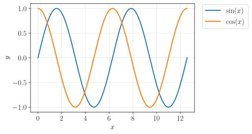
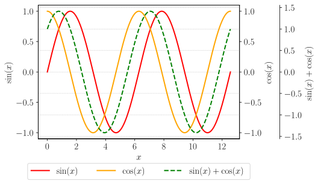
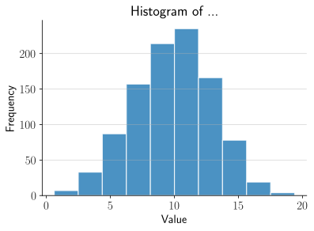

# Commonly Used Plots

## Scatter Plots

```python
fig, ax = plt.subplots(figsize=(6, 4))

##########
#  plot  #
##########
x = np.linspace(0, 4*np.pi, 1000)
y1 = np.sin(x)
y2 = np.cos(x)
p1 = ax.plot(x, y1, lw=2.0, label="$\sin(x)$")
p2 = ax.plot(x, y2, lw=2.0, label="$\cos(x)$")

###################
#  plot settings  #
###################
# ax.set_title("")
ax.set_xlabel("$x$")
ax.set_ylabel("$y$")
# ax.set_ylim([0, 1])
# ax.set_xlim([0, 1])
# ax.set_yscale("")
plt.grid(color='gray', alpha=0.5, linestyle='dashed', linewidth=0.5)

############
#  legend  #
############
lines = p1 + p2
labels = [l.get_label() for l in lines]
ax.legend(lines, labels, loc='upper right', bbox_to_anchor=(1.35, 1.025))
#ax.legend(loc='upper center')

##########
#  save  #
##########
plt.show()
fig.savefig(save_location + "scatterplot.svg", bbox_inches="tight")
```



## Twin Axis Plots

```python
fig, ax1 = plt.subplots(figsize=(6, 4))
ax2 = ax1.twinx()
ax3 = ax1.twinx()

# offset the right spine of ax2
ax3.spines["right"].set_position(("axes", 1.2))

##########
#  plot  #
##########
x = np.linspace(0, 4*np.pi, 1000)
y1 = np.sin(x)
y2 = np.cos(x)
y3 = y1 + y2
p1 = ax1.plot(x, y1, lw=2.0, color="red", label="$\sin(x)$")
p2 = ax2.plot(x, y2, lw=2.0, color="orange", label="$\cos(x)$")
p3 = ax3.plot(x, y3, lw=2.0, color="green", ls="dashed", label="$\sin(x) + \cos(x)$")

###################
#  plot settings  #
###################
# ax.set_title("")
ax1.set_xlabel("$x$")
ax1.set_ylabel("$\sin(x)$")
ax2.set_ylabel("$\cos(x)$")
ax3.set_ylabel("$\sin(x) + \cos(x)$")
# ax1.set_ylim([0, 1])
# ax1.set_xlim([0, 1])
# ax1.set_yscale("")
plt.grid(color='gray', alpha=0.5, linestyle='dashed', linewidth=0.5)

############
#  legend  #
############
lines = p1 + p2 + p3
labels = [l.get_label() for l in lines]
ax1.legend(lines, labels, loc='upper center', bbox_to_anchor=(0.5, -0.15), ncol=len(lines))

##########
#  save  #
##########
plt.show()
#fig.savefig(save_location + "twinplot.svg", bbox_inches="tight")
```



## Bar Charts

```python
def plot_bar_chart(data, labels, horizontal=False, label_top=False):

    fig, ax = plt.subplots(figsize=(6, 4))

    ##########
    #  plot  #
    ##########
    if horizontal:
        ax.barh(labels, data, height=0.6, color='cornflowerblue', edgecolor='black', linewidth=1.2)
        if label_top:
            for i, v in enumerate(data):
                ax.text(v*1.05, i, str(v), color='black', fontweight='bold', ha='left', va='center')
    else:
        ax.bar(labels, data, width=0.6, color='cornflowerblue', edgecolor='black', linewidth=1.2)
        if label_top:
            for i, v in enumerate(data):
                ax.text(i, v*1.05, str(v), color='black', fontweight='bold', ha='center', va='bottom')

    ###################
    #  plot settings  #
    ###################
    if horizontal:
        ax.grid(axis="x", alpha=0.5)
        ax.set_xlim([0, np.max(data) * 1.1])
        ax.set_xlabel("Value")
        ax.set_ylabel("Category")
    else:
        ax.grid(axis="y", alpha=0.5)
        ax.set_ylim([0, np.max(data) * 1.1])
        ax.set_xlabel("Category")
        ax.set_ylabel("Value")

    ax.set_title("Bar Chart Test")
    ax.spines['top'].set_visible(False)
    ax.spines['right'].set_visible(False)
    plt.tight_layout()

    ##########
    #  save  #
    ##########
    plt.show()
    #fig.savefig(save_location + "barplot.svg", bbox_inches="tight")
```

### Example

```python
data = np.array([10, 20, 30, 40, 50])
labels = ['A', 'B', 'C', 'D', 'E']
plot_bar_chart(data, labels, horizontal=False, label_top=True)
```


## Grouped Bar Charts

```python
def plot_group_bar_chart(data, labels, groups, horizontal=False, label_top=False):

    fig, ax = plt.subplots(figsize=(6, 4))

    ################
    #  plot setup  #
    ################
    num_groups = len(groups)
    num_bars = data.shape[0]
    bar_width = 0.2
    x_positions = np.arange(num_bars)

    ##########
    #  plot  #
    ##########
    # plot the bars for each group
    for i, group in enumerate(groups):
        x = x_positions + i * bar_width
        if horizontal:
            ax.barh(x, data[:, i], height=bar_width, label=group, edgecolor="black", linewidth=1.2)
        else:
            ax.bar(x, data[:, i], width=bar_width, label=group, edgecolor="black", linewidth=1.2)


        if label_top:
            for j, v in enumerate(data[:, i]):
                if horizontal:
                    ax.text(v*1.05, x[j], str(v), color='black', fontweight='bold', ha='left', va='center')
                else:
                    ax.text(x[j], v*1.05, str(v), color='black', fontweight='bold', ha='center', va='bottom')

    ###################
    #  plot settings  #
    ###################
    if horizontal:
        ax.set_yticks(x_positions + bar_width * (num_groups - 1) / 2)
        ax.set_yticklabels(labels)
        ax.grid(axis="x", alpha=0.5)
        ax.set_xlim([0, np.max(data) * 1.1])
        ax.set_xlabel("Value")
        ax.set_ylabel("Category")
    else:
        ax.set_xticks(x_positions + bar_width * (num_groups - 1) / 2)
        ax.set_xticklabels(labels)
        ax.grid(axis="y", alpha=0.5)
        ax.set_ylim([0, np.max(data) * 1.1])
        ax.set_xlabel("Category")
        ax.set_ylabel("Value")

    ax.set_title("Bar Chart of ...")
    ax.spines["top"].set_visible(False)
    ax.spines["right"].set_visible(False)
    ax.legend()
    plt.tight_layout()

    ##########
    #  save  #
    ##########
    plt.show()
    #fig.savefig(save_location + "groupbarplot.svg", bbox_inches="tight")
```

### Example

```python
data = np.array([[10, 20, 5], [30, 40, 15], [50, 60, 12]])
labels = ['A', 'B', 'C']
groups = ['Dogs', 'Cats', 'Dolphins']
plot_group_bar_chart(data, labels, groups, horizontal=False, label_top=True)
```


## Histograms

```python
def plot_histogram(data, num_bins=10, filter_data=False):

    #################
    #  filter data  #
    #################
    # compute the interquartile range (IQR) and use it to filter out outliers
    if filter_data:
        q1, q3 = np.percentile(data, [25, 75])
        iqr = q3 - q1
        lower_bound = q1 - 1.5 * iqr
        upper_bound = q3 + 1.5 * iqr
        data_filtered = data[(data >= lower_bound) & (data <= upper_bound)]
    else:
        data_filtered = data

    ##########
    #  plot  #
    ##########
    fig, ax = plt.subplots(figsize=(6, 4))
    n, bins, patches = ax.hist(data_filtered, bins=num_bins, edgecolor='white', linewidth=1.2, alpha=0.8)

    ###################
    #  plot settings  #
    ###################
    ax.set_title("Histogram Test")
    ax.set_xlabel("Value")
    ax.set_ylabel("Frequency")
    ax.spines["top"].set_visible(False)
    ax.spines["right"].set_visible(False)
    ax.grid(axis="y", alpha=0.5)

    ##########
    #  save  #
    ##########
    plt.show()
    #fig.savefig(save_location + "histplot.svg", bbox_inches="tight")
```

### Example

```python
data = np.random.normal(loc=10, scale=3, size=1000)
plot_histogram(data)
```



## Contour Plots

```python
def plot_contour(func, xlim=(-5, 5), ylim=(-5, 5), zlim=(-5, 5), levels=10):

    ################
    #  plot setup  #
    ################
    x = np.linspace(xlim[0], xlim[1], 100)
    y = np.linspace(ylim[0], ylim[1], 100)
    X, Y = np.meshgrid(x, y)

    ##############
    #  function  #
    ##############
    Z = func(X, Y)

    ##########
    #  plot  #
    ##########
    fig, ax = plt.subplots(figsize=(6, 4))
    p1 = ax.contour(X, Y, Z, levels=levels, cmap='viridis')
    ax.clabel(p1, inline=True, fontsize=10, fmt='%1.1f')

    ###################
    #  plot settings  #
    ###################
    ax.set_title("Contour plot")
    ax.set_xlabel("$x$")
    ax.set_ylabel("$y$")
    ax.set_ylim(*xlim)
    ax.set_xlim(*ylim)
    ax.grid(color='gray', alpha=0.5, linestyle='dashed', linewidth=0.5)

    ##########
    #  save  #
    ##########
    plt.show()
    #fig.savefig(save_location + "contourplot.svg", bbox_inches="tight")
```

### Example

```python
func = lambda x, y: -np.exp(-(x*y-3/2)**2 - (y-3/2)**2)
plot_contour(func, xlim=(0, 3), ylim=(0, 3))
```


## Bode Plots

```python
def evaluate_tf(tf, freq_min=1e-2, freq_max=1e3, points_per_decade=20):

    # define the transfer function expression as a lambda function
    tf_expr = lambda s: eval(tf)

    # generate sampling frequency
    num_decades = int(np.ceil(np.log10(freq_max) - np.log10(freq_min)))
    num_points = points_per_decade * num_decades + 1
    frequency = np.logspace(np.log10(freq_min), np.log10(freq_max), num=num_points)

    # complex frequency
    omega = 2 * np.pi * frequency
    s = 1j * omega

    # evaluate the transfer function over the complex plane
    freq_resp = tf_expr(s)

    return omega, freq_resp
```

```python
def bode_plot(freq_resp, freq, xlim=None):

    ################
    #  plot setup  #
    ################
    mag = 20.0 * np.log10(abs(freq_resp))
    phase = np.rad2deg(np.unwrap(np.angle(freq_resp)))

    ##########
    #  plot  #
    ##########
    fig, ax_mag = plt.subplots(figsize=(10, 5))
    p1 = ax_mag.plot(freq, mag, label="gain")

    ax_phase = ax_mag.twinx()
    p2 = ax_phase.plot(freq, phase, label="phase", linestyle="dashed", color="red")

    ###################
    #  plot settings  #
    ###################
    # magnitude axis
    ax_mag.set_title("Bode Plot")
    ax_mag.set_xlabel("Frequency (rad/s)")
    ax_mag.set_ylabel("Magnitude (dB)")
    ax_mag.set_xscale("log")

    # phase axis
    ax_phase.set_ylabel("Phase (deg)")
    # ax_phase.set_xscale("log")

    # add grid
    ax_mag.grid(color="gray", alpha=0.5, linestyle="dashed", linewidth=0.5, which="both")

    # limit the frequency
    if xlim:
        ax_mag.set_xlim(*xlim)

    # add legend
    lines = p1 + p2
    labels = [l.get_label() for l in lines]
    ax_mag.legend(lines, labels)

    ##########
    #  save  #
    ##########
    plt.show()
    #fig.savefig(save_location + "bodeplot.svg", bbox_inches="tight")
```

### Example

```python
tf_expr = "((s+1)*(s+10000))/((s+100)**2)"
omega, freq_resp = evaluate_tf(tf_expr, freq_max=1e5)
bode_plot(freq_resp, omega, xlim=[1e-1, 1e5])
```


## Nyquist Plots

```python
def evaluate_tf(tf, freq_min=1e-2, freq_max=1e3, points_per_decade=50):

    # define the transfer function expression as a lambda function
    tf_expr = lambda s: eval(tf)

    # generate sampling frequency
    num_decades = int(np.ceil(np.log10(freq_max) - np.log10(freq_min)))
    num_points = points_per_decade * num_decades + 1
    frequency = np.logspace(np.log10(freq_min), np.log10(freq_max), num=num_points)

    # complex frequency
    omega = 2 * np.pi * frequency
    s = 1j * omega

    # evaluate the transfer function over the complex plane
    freq_resp = tf_expr(s)

    return omega, freq_resp
```

```python
def nyquist_plot(freq_resp, xlim=(-1.2, 1), ylim=(-1, 1)):

    ##########
    #  plot  #
    ##########
    # plot the Nyquist plot for positive frequencies
    fig, ax = plt.subplots()
    ax.plot(np.real(freq_resp), np.imag(freq_resp), label="Positive Frequencies")

    # reflect the plot across the real axis for negative frequencies
    ax.plot(np.real(freq_resp), -np.imag(freq_resp), "b--", label="Nositive Frequencies")

    # mark the critical frequency with a red cross
    ax.plot([-1, -1], [0, 0], "rx", label="-1 + 0j")

    ###################
    #  plot settings  #
    ###################
    # add labels and title
    ax.set_title("Nyquist Plot")
    ax.set_xlabel("Real")
    ax.set_ylabel("Imaginary")
    ax.grid(which="both", linestyle="--", linewidth=0.5)
    ax.set_xlim(*xlim)
    ax.set_ylim(*ylim)

    ##########
    #  save  #
    ##########
    plt.show()
    #fig.savefig(save_location + "nyquistplot.svg", bbox_inches="tight")
```

### Example

```python
tf_expr = "1 / (s**2 + s + 1)"
omega, freq_resp = evaluate_tf(tf_expr, freq_min=1e-5, points_per_decade=100)
nyquist_plot(freq_resp, xlim=(-1.2, 1.2), ylim=(-1.1, 1.1))
```


## Frequency Plots

```python
def plot_frequency_response(signal, fs):

    ################
    #  plot setup  #
    ################
    # compute the Fourier Transform of the signal
    Y = np.fft.fft(signal)/len(signal)

    # compute the frequency axis
    freq = np.fft.fftfreq(len(signal), 1/fs)

    ##########
    #  plot  #
    ##########
    fig, ax = plt.subplots(figsize=(8, 4))
    # plt.plot(freq, np.abs(Y)) # plot positive and negative frequencies
    # plot only the positive frequencies
    ax.plot(freq[:len(freq)//2], 2*np.abs(Y)[:len(Y)//2], color='blue', marker='o', fillstyle='none', markevery=10)

    ##################
    #  plot setting  #
    ##################
    ax.set_title('Frequency Response')
    ax.set_xlabel('Frequency (Hz)')
    ax.set_ylabel('Amplitude')
    ax.grid(color="gray", alpha=0.5, linestyle="dashed", linewidth=0.5, which="both")

    ##########
    #  save  #
    ##########
    fig.savefig(save_location + "fftplot.svg", bbox_inches="tight")
    plt.show()
```

```python
periods = 1 # periods of the signal to capture (more sample is better)
fs = 1000 # sampling frequency
t = np.arange(0, periods, 1/fs) # sampling time points
y = np.sin(2*np.pi*20*t) + np.sin(2*np.pi*400*t)
plot_frequency_response(y, fs)
```


