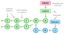
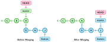
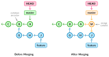
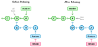
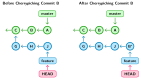

# Introduction to Git

## Setting Up Git

Before making any commits, it is essential to configure **user information**.
This is a one-time setup and ensures that each commit carries your authorship
information.

```bash
git config --global user.name "Your name"
git config --global user.email "Your email"
```

The above process can also be done by directly editing the `~/.gitconfig` file.

```bash
# content of `~/.gitconfig`
[user]
    email = Your email
    name = Your name
# ...
```

## Initializing Your Repository

To start working with Git, you need to run `git init` in the root of your
project directory. This creates a `.git` folder that contains a Git repository,
which manages your project's history.

## Basic Git Workflow

### File Tracking

Git maintains three versions of each file: the **working directory version**,
the **staged version** (index), and the **committed version** (HEAD).

To use Git for version control, specify which files should be tracked. Assume
there is a file named `<file>` in your working directory.

```python
# content of <file>
print("hello 1")
```

To initiate tracking, execute `git add <file>`. This process is known as
**staging**. The file is now staged in the **index**, which is the area that
holds files ready to be **committed**.

### Committing Changes

A **commit** serves as a snapshot of your project at a given time. To commit
the staged files, run `git commit -m "descriptive message"`.

To view the commit history, use `git log`.

```bash
# output of `git log`
commit 6db20b4804b432beb04abe2a3e850e03e0ec1f27
Author: John Doe <john.doe@users.noreply.github.com>
Date:   Sun Sep 4 21:20:25 2022 -0400

    commit message displayed here
```

### Making and Updating Stages

Modify `<file>` as shown below.

```python
print("hello 1")
print("hello 2")
```

Running `git status` shows that the working version of `<file>` differs
from the committed version. To add the file to the statging area, re-run `git
add <file>`.

### Tracking Multiple File Versions

Modify `<file>` again as shown below.

```python
print("hello 1")
print("hello 2")
print("hello 3")
```

Three versions of `<file>` now exist:

1. The version in the **working directory** containing the most recent changes.
2. The version in the **index** containing the last staged changes.
3. The version in **HEAD** containing the last committed changes.

### Viewing and Comparing Changes

-   `git diff <file>`: compares working directory and index.
-   `git diff --cached <file>`: compares index and last commit.

### Restoring Files

-   `git checkout <file>`: discard changes and revert to the last committed state.
-   `git restore --staged <file>`: unstage file.

## Ignoring Files

Running `git status` lists all files in the working directory, including those
that Git is not tracking. To ignore specific files, add their paths to the
`.gitignore` file, which you typically create in the root of your project
directory. You can use regular expressions to specify file paths.

```bash
# Ignore specific files
file-to-ignore.txt

# Ignore a specific file in the root directory
/file-in-root.txt

# Ignore all files starting with temp
temp*

# Ignore all files with .log extension
*.log

# Ignore files with a specific pattern
*.log.[0-9]

# Ignore the 'build' directory at the root of the repository
/build/

# Ignore all directories named 'build'
build/

# Ignore all files and directories directly inside any build directory, non-recursively
build/*

# Ignore all files and directories within any build directory, recursively
build/**

# Similar to build/**, but explicitly targets files rather than directories
build/**/*

# Ignore all .log files in a directory named 'docs'
build/**/*.log

# Ignore all files in logs/ except important-log.log
logs/*
!important-log.log
```

# Branching

## Introduction

Branching in Git allows developers to work on different features or bug fixes
in isolation from the main codebase, making it easier to manage and collaborate
on large projects.

Technically, a branch is a **pointer** to a particular commit. When you create a
new branch, you are essentially creating a new pointer that can move
independently of other branch pointers.



The default branch, often named **master** or **main**, is created when the
first commit is made in the repository. Subsequent commits move the branch
pointer forward, forming a history of commits for that branch.

### Creating and Switching Branches

To create a new branch in Git and switch to it, you have two options.

- You can run `git branch <branch-name>` to create the branch, and then use
  `git checkout <branch-name>` to switch to it.

- Alternatively, you can do both tasks at once by using the command `git
  checkout -b <branch-name>`.

### The HEAD Pointer

The **HEAD** pointer is a reference to the latest commit in the currently
**checked-out branch** and generally points to the branch pointer.

When the HEAD pointer points to a commit other than one referenced by the
branch pointer, you are in a **detached HEAD** state. Making commits in a
detached HEAD state is generally not advisable because new commits made in this
state will not be associated with any existing branch and can be easily lost
when you switch branches.

### Parent and Ancestor References

In Git, the caret (`^`) and tilde (`~`) characters are used to reference
commits relative to other commits.

#### Caret (`^`)

The caret (`^`) is used to move upwards from a commit to its parent commit(s).

- `HEAD^`: Refers to the parent of the current commit (`HEAD`). If the
  commit has multiple parents (due to a merge), it defaults to the first
  parent.

- `HEAD^2`: In a merge commit with multiple parents, `HEAD^2` refers
  to the second parent.

- `HEAD^^`: Refers to the grandparent of the current commit.

In the figure above, `HEAD` points to `A`, `HEAD^` points to `B`, `HEAD^^`
points to `C`, and `HEAD^^2` points to `F`.

#### Tilde (`~`)

The tilde `~` is used to move a number of steps back along the first parent of
each commit.

- `HEAD~` or `HEAD~1`: Equivalent to `HEAD^`, refers to the parent
  of the current commit.

- `HEAD~~` or `HEAD~2`: Equivalent to `HEAD^^`, refers to the
  grandparent of the current commit.

- `HEAD~n^m`: Refers to the `m`th parent of the `n`th parent of the
  current commit.

In the figure above, `HEAD` points to `A`, `HEAD~` points to `B`,
`HEAD~2` points to `C`, `HEAD~1^2` points to `F`, and `HEAD~1^2~1`
points to `G`.

## Merging Branches

Merging is the process of integrating changes from one branch into another.
There are different types of merges in Git, the most commonly used being
**fast-forward** and **three-way** merges.

### Fast-forward Merge

A fast-forward merge is possible when the feature branch is ahead of the master
branch, and there are **no new changes in the master branch** since the feature
branch was created. In this case, Git simply moves the master branch pointer to
the feature branch pointer without creating an extra merge commit.



If you need to create a merge commit during a fast-forward merge for
record-keeping purposes, you can use `git merge --no-ff`.

### Three-Way Merge

When the feature and master branches have divergent commits, a three-way merge is
performed.

A three-way merge involves three entities: the **base commit**, the **master
branch commit**, and the **feature branch commit**.

Steps to perform a three-way merge:

1. Git identifies the base commit that serves as the common ancestor for both
   branches.

2. Git creates two sets of changes: one that shows the difference between the
   base commit and the master branch commit, and another that shows the
   difference between the base commit and the feature branch commit.

3. Git tries to apply both sets of changes to the base commit. If the changes
   do not conflict, Git creates a new commit on the master branch, having the
   master and feature branches as parents.

4. If there are conflicts, Git prompts you to resolve them manually. Once
   resolved, you commit the changes.



## Resolving Merge Conflicts

Conflicts arise when the same lines in the same file have been modified
differently in separate branches. Git will mark the conflicts in the file and
pause the merge process.

Here are the steps to resolve conflicts:

1. **Identify Conflicts**: Run `git status` to see which files have conflicts.

2. **Open Conflicting Files**: Open the files with conflicts in a text editor.

3. **Edit Conflicts**: Conflicts are marked with `>>>>>>`, `<<<<<<` and
   `======`. The changes from your currently checked-out branch are above the
   `======` and the changes from the branch you're merging from are below it.

   ```
   <<<<<<< HEAD
   // Code from the checked-out branch
   =======
   // Code from the branch you're merging from
   >>>>>>> feature-branch
   ```

3. **Resolve Conflicts**: Manually edit the lines to keep the code you want.

4. **Remove Markers**: Delete the conflict markers `>>>>>>`, `<<<<<<` and
   `======`.

5. **Mark as Resolved**: After resolving the conflict and removing markers,
   save the file.

6. **Commit Changes**: Repeat steps 3 to 5 for all other files with merge
   conflicts. Stage the resolved files by using `git add <filename>` and then
   commit the changes with `git commit`.

## Example

```bash
#!/bin/bash

# Create a new directory for our Git repository
mkdir git_merge_example
cd git_merge_example

# Initialize a new Git repository
git init

# Create an initial file and commit it
echo "Line 1" > example.txt
echo "Line 2" >> example.txt
git add example.txt
git commit -m "Initial commit"

# Create and checkout a new branch named 'feature'
git branch feature
git checkout feature

# Modify an existing line in the 'feature' branch
sed -i 's/Line 2/Line 2 modified in feature branch/' example.txt
git commit -am "Modify line in feature branch"

# Switch back to main branch
git checkout main

# Modify the same line in the 'main' branch, introducing a conflict
sed -i 's/Line 2/Line 2 modified in main branch/' example.txt
git commit -am "Modify line in main branch"

# Output instructions for the user
echo "==>You are now on the main branch"
echo "==>To merge the feature branch into main, run 'git merge feature'"
echo "==>Resolve any conflicts that occur"
echo "==>Remember to stage each resolved file using 'git add <file>'"
echo "==>Then use 'git commit m <message>' to commit the changes"
echo "==>Run 'git log' to view the commit history"
```

# Rebasing

## Introduction

In the fundamental Git workflow, you develop a new feature in a dedicated
branch, then merge it back into a production branch once it is finished using
`git merge`.

As an alternative, instead of tying the branches together with a merge
commit, rebasing moves the entire feature branch to the tip of `master` as
shown below.



This serves the same purpose as `git merge`, but with two major differences:

- It results in a linear project history (only single parents).
- It prevents your project history from being littered with meaningless merge
  commits.

There are two scenarios where you would want to do this.

- First, the feature relies on new commits in the `master` branch.
- Second, if the feature was complete, it would now be set up for
  a fast-forward merge into master.

## Interrative Rebase

Interactive rebase, initiated with `git rebase -i main` while on the `feature`
branch, provides granular control over the rebase process. This command opens
an editor displaying a list of all commits from the `feature` branch that will
be reapplied to the `main` branch. The list looks like this:

```bash
pick commit-hash1 "description for oldest commit on feature"
pick commit-hash2 "description for 2nd oldest commit on feature"
pick commit-hash3 "description for 3nd oldest commit on feature"
```

This list allows you to perform various actions on each commit before starting
the rebase.

- In the interactive rebase editor, you can reorder commits by changing their
  order in the list. This is useful for improving the logical flow of your
  commits.

- You can apply commits as they are using the `pick` action. To edit a commit's
  content before applying it, change `pick` to `edit`. This pauses the rebase,
  allowing you to make changes before continuing. To skip a commit entirely,
  remove it from the list.

- Additionally, you can `squash` commits, combining multiple commits into one.
  This is useful for condensing a series of small or related commits into a
  single, cohesive commit, making the project history cleaner and easier to
  understand.

## Rebase Conflicts

Let's assume that you are on a `feature` branch and want to rebase commits from
the `main` branch. You will do so by running `git rebase main`. Git then
applies each commit from `feature` sequentially, starting from oldest, onto the
latest commit of `main`. If conflicts arise during this process, Git will
pause, allowing you to manually resolve the conflicts. Once resolved, continue
the rebase with `git rebase --continue`. If a specific commit should be
skipped, use `git rebase --skip`. To abort the rebase and return `feature` to
its original state, use `git rebase --abort`.

## Dangers of Rebasing

Rebasing, while powerful, carries significant risks, particularly concerning
the rewriting of commit history. Internally, rebasing doesn't move commits but
instead creates new commits that incorporate the desired changes. For example,
after rebasing `feature` onto `main`, the original commits `G`, `H`, and `J`
are replaced by new commits `G'`, `H'`, and `J'`. If someone else has a copy of
the repository before the rebase and then pulls the rebased commits, their
local repository will contain both the old and new commits. If they push their
repository to a remote repository, it could end up with both sets of commits,
effectively reviving the old commits. This can lead to confusion and the
potential for new work being based on the outdated commits. Therefore, you
should never rebase commits that have been pushed to a public repository unless
you are certain that nobody has based their work on them.

Conflicts during rebasing are another risk. Unlike merging, where conflicts are
resolved once, rebasing can result in multiple conflicts as each commit is
reapplied. For instance, if a series of commits on `feature` frequently modify
the same code as `main`, you might need to resolve conflicts repeatedly, which
can be tedious and error-prone. This increases the chances of making mistakes
during conflict resolution, potentially leading to a broken or unstable
codebase.

## Example

```bash
#!/bin/bash

# Create a new directory for our Git repository and navigate into it
mkdir git_rebase_example
cd git_rebase_example

# Initialize a new Git repository
git init

# Create an initial file and commit it to the main branch
echo "Line 1" > example.txt
echo "Line 1" > another.txt
git add example.txt another.txt
git commit -m "First commit on main"

# Create a feature branch from the main
git branch feature
git checkout feature

# Modify files in the feature branch to create potential conflicts
sed -i 's/Line 1/Line 1 modified in feature branch/' example.txt
sed -i 's/Line 1/Line 1 modified in feature branch/' another.txt
git add example.txt another.txt
git commit -m "First commit on feature"

# Modify files in the feature branch
echo "Line 2 from feature branch" >> example.txt
git add example.txt another.txt
git commit -m "Second commit on feature"

# Go back to the main branch and make further commits
git checkout main
echo "Line 2 from main branch" >> example.txt
echo "Line 2 from main branch" >> another.txt
git add example.txt another.txt
git commit -m "Second commit on main"

# Make other updates on main
echo "Line 3 from main branch" >> example.txt
echo "Line 3 from main branch" >> another.txt
git add example.txt another.txt
git commit -m "Third commit on main"

# Check out the feature branch again for rebase
git checkout feature

# Output instructions for the user
echo "==>You are now on the feature branch"
echo "==>To rebase onto main, run 'git rebase main'"
echo "==>Resolve any conflicts that occur"
echo "==>Remember to stage each resolved file using 'git add <file>'"
echo "==>Then use 'git rebase --continue' to proceed with the rebase"
echo "==>Or 'git rebase --skip' to skip a commit"
echo "==>If you need to abort the rebase, use 'git rebase --abort'"
```

# Cherry-Picking

Cherry picking in Git means to choose a commit from one branch and apply it
onto another. This is in contrast with other ways such as `merge` and `rebase`
which normally apply many commits onto another branch. This is particularly
useful when you need a specific bug fix or feature from a different branch but
do not want to integrate all its changes. The command `git cherry-pick
<commit-hash>` takes the changes introduced by the specified commit and applies
them to your current branch.




## Example

```bash
#!/bin/bash

# Create a new directory for our Git repository and navigate into it
mkdir git_cherry_pick_example
cd git_cherry_pick_example

# Initialize a new Git repository
git init

# Create an initial file and commit it to the main branch
echo "Line 1" > example.txt
echo "Line 1" > another.txt
git add example.txt another.txt
git commit -m "First commit on main"

# Create a feature branch from the main
git branch feature
git checkout feature

# Modify files in the feature branch
echo "Feature branch line 2" >> example.txt
git add example.txt
git commit -m "First commit on feature"

# Modify another file in the feature branch
echo "Feature branch line 2" >> another.txt
git add another.txt
git commit -m "Second commit on feature"

# Go back to the main branch and make further commits
git checkout main
echo "Main branch line 2" >> example.txt
git add example.txt
git commit -m "Second commit on main"

# Make another update on main
echo "Main branch line 3" >> example.txt
git add example.txt
git commit -m "Third commit on main"

# Check out the feature branch again
git checkout feature

# Output instructions for the user
echo "==> You are now on the feature branch"
echo "==> To cherry-pick specific commits from main to feature, follow these steps:"

# List the commits from main for reference
echo "==> Commits in main branch:"
git log --oneline main

# Output the steps to cherry-pick specific commits
echo "==> Identify the commit hash from the main branch that you want to cherry-pick."
echo "==> Use 'git cherry-pick <commit-hash>' to apply the specific commit to the feature branch."
echo "==> Resolve any conflicts that occur."
echo "==> If conflicts are resolved, stage the resolved files using 'git add <file>'."
echo "==> Then use 'git cherry-pick --continue' to proceed."
echo "==> If you need to abort the cherry-pick, use 'git cherry-pick --abort'."
```

# Git Stashing

Git allows us to switch branches only when there are no changes to be
committed. In the event that we must change to a different branch and our
changes are not ready to be committed, we can use `git stash` to temporarily
store our changes.

## Example

```bash
#!/bin/bash

# Create a new directory for our Git repository and navigate into it
mkdir git_stash_example
cd git_stash_example

# Initialize a new Git repository
git init

# Create an initial file and commit it to the main branch
echo "Line 1" > example.txt
git add example.txt
git commit -m "First commit on main"

# Create a feature branch from the main
git branch feature
git checkout feature

# Modify files in the feature branch but do not commit
echo "Feature branch line 2" >> example.txt

# Output instructions for the user
echo "==> You have uncommitted changes on the feature branch"
echo "==> To save these changes temporarily without committing, you can use Git stash"
echo "==> To create a named stash, use 'git stash push -m \"stash message\"'"
git stash

# Output the steps for viewing stashed changes
echo "==> To view your stashed changes, use 'git stash list'"

# Checkout main branch
git checkout main

# Return to the feature branch
git checkout feature

# Output the list of stashed changes
git stash list

# Output the steps for applying stashed changes
echo "==> To reapply your stashed changes, use 'git stash apply'"
echo "==> To reapply and remove the latest stash from the list, use 'git stash pop'"
echo "==> To apply a specific stash from the list, use 'git stash apply stash@{n}'"
echo "==> To clear all stashes, use 'git stash clear'"
git stash pop
```

# Collaborating

Git creates an isolated development environment for each developer. Automatic
synchronization of changes between different repositories is not enabled, so
explicit actions like "pulling" or "pushing" are required to share work.


## Establishing a Remote Connection

### Setting Up a Central Repository

To centralize collaborative efforts, you can create an empty or **bare**
central repository using the command `git init --bare project-repo.git`.

Consider two users, Alice and Bob, who want to work on this repository:

- Both users first clone the centralized repository using `git clone
  <path_to_project-repo.git>`.
- When they do this, Git establishes a remote connection to `project-repo.git`,
  naming it `origin`.
- Use `git remote show origin` to show details about the remote connection,
  such as branches and URLs.

### Peer-to-Peer Collaboration

Beyond the central repository, users can interact directly with each other.
Suppose Bob wants to interact directly with Alice's repository. In this
scenario, Bob adds Alice's repository as a new remote source using `git remote
add alice <path_to_alice_repository>`.

## Making and Sharing Changes

### Via Central Repository

If Alice makes a change by creating a new file and commits it, these changes
can be pushed directly to `project-repo.git` using the following commands:

- `git add <file>`
- `git commit -m "commit message"`
- `git push origin <local_branch>:<remote_branch>`

On the other side, Bob fetches these changes using `git fetch`, and merges them
with:

- `git merge origin/<branch_name>`

If there is only one remote connection (`origin`) and you are working on the
`main` branch, specifying `origin` and `main` in the `git push` and `git merge`
commands is often optional due to default tracking settings.

### Direct Peer-to-Peer

Alternatively, if Alice has made changes but has not yet pushed them to
`project-repo.git`, Bob can still fetch and merge these changes directly from
Alice, provided Bob has added Alice as a remote. The commands for this are:

- `git fetch alice`
- `git merge alice/<branch_name>`

## Forking and Pull Requests

### Cloning vs. Forking

Cloning and forking serve different purposes in a Git workflow. Cloning
involves creating a local copy of a remote repository, including all files,
commit history, and branches, enabling direct work on the project. Conversely,
forking creates a personal copy of another user's repository on your Git
hosting account, allowing you to make changes independently before proposing
them back to the original project.

### Pushing vs. Pull Request

Pushing and pull requests (PRs) are essential for integrating changes into a
repository. Pushing uploads your local changes to a remote repository, making
them accessible to collaborators. A pull request, however, is a formal request
to merge your changes from one branch or fork into another branch or the main
repository, facilitating code review and collaboration before integration.

### Example Workflow with Pull Requests

1. **Fork the Repository:** Alice forks Bob's repository on GitHub.
2. **Clone the Forked Repository:** Alice clones her fork to her local machine
   using `git clone <forked_repository_url>`.
3. **Create a New Branch:** Alice creates a new branch for her feature with
   `git checkout -b new-feature`.
4. **Make Changes and Commit:** Alice makes her changes and commits them using
   `git add` and `git commit`.
5. **Push the Changes:** Alice pushes her new branch to her forked repository
   using `git push origin new-feature`.
6. **Create a Pull Request:** On GitHub, Alice creates a pull request to merge
   her changes from the `new-feature` branch into Bob's main repository.
7. **Code Review and Discussion:** Bob reviews Alice's pull request, discusses
   any necessary changes or improvements, and may request further
   modifications.
8. **Merge the Pull Request:** Once Bob is satisfied with the changes, he
   merges the pull request into the main branch of his repository.
9. **Sync Forked Repository:** Alice updates her forked repository by pulling
   the latest changes from Bob's repository to keep her fork in sync.

# Others

For remote repositories that require usernames and passwords, the user will be
required to type their credentials every time they request access to the remote
repository. This can be avoided by allowing git to start saving credentials.

```bash
git config --global credential.helper store
```

Note that the credentials are saved in plain text inside the
`~/.git-credentials` file.

Another possibility is to keep the credentials in memory for a limited length
of time.

```bash
git config credential.helper 'cache --timeout=<time_in_seconds>'
```

# Basic Command Usage

## git add

```bash
# Stage a single file for commit
git add <file>

# Stage all changes in a folder
git add <folder>/

# Stage all modified files in the pwd for commit
git add .

# Stage all modified files, but not new (untracked) files
git add -u

# Stage all modified and new (untracked) files in the repository
git add -A
```


## git branch

```bash
# List all local branches
git branch

# List all remote branches
git branch -r

# List both local and remote branches
git branch -a

# Create a new branch
git branch <branch-name>

# Delete a branch
git branch -d <branch-name>

# Delete a branch forcefully
git branch -D <branch-name>

# Rename a branch
git branch -m <old-name> <new-name>

# Create a new branch and switch to it
git checkout -b <branch-name>

# Create a new branch from a specific commit
git branch <branch-name> <commit-hash>

# Show the last commit on each branch
git branch --sort=-committerdate

# Track a remote branch
git branch --track <branch-name> <remote>/<branch>

# Set upstream for a branch
git branch --set-upstream-to=<remote>/<branch> <branch-name>

# Untrack a remote branch
git branch --unset-upstream <branch-name>

# Compare a branch with the current branch
git branch --contains <branch-name>

# Create a new branch without switching to it
git branch --no-track <branch-name>

# Delete remote-tracking references
git branch -dr <remote>/<branch>

# Show branches that you are merged or not merged into the current branch
git branch --merged
git branch --no-merged
```

## git cherrypick

```bash
# Apply changes from a specific commit to the current branch
git cherry-pick <commit-hash>

# Apply changes from multiple commits to the current branch
git cherry-pick <commit1> <commit2>

# Apply changes and immediately commit them
git cherry-pick -x <commit-hash>

# Apply changes but do not commit them
git cherry-pick --no-commit <commit-hash>

# Continue cherry-pick after resolving conflicts
git cherry-pick --continue
```

## git commit

```bash
# Commit staged changes
git commit -m "Commit message"

# Commit all changes, including unstaged
git commit -am "Commit message"

# Amend last commit without changing commit message
git commit --amend --no-edit

# Amend last commit with new commit message
git commit --amend -m "New commit message"
```

## git diff

```bash
# Show changes between working directory and staging area
git diff

# Show changes in a specific file between staging and working directory
git diff <file>

# Show changes for a specific directory between staging and working directory
git diff <directory>

# Show changes between staging area and latest commit
git diff --cached

# Show changes between two specific commits
git diff <commit1> <commit2>

# Show changes between working directory and specific commit
git diff <commit>

# Show only names of changed files between two commits
git diff --name-only <commit1> <commit2>

# Show statistics of changes between two commits
git diff --stat <commit1> <commit2>

# Show diff ignoring white space changes
git diff -w

# Show changes between two branches
git diff <branch1>..<branch2>

# Show changes since a specific commit
git diff <commit>..
```

## git log

```bash
# Show commit logs
git log

# Show commit logs for a specific file
git log -- <file>

# Show commit logs with diff
git log -p

# Show last n commits
git log -n

# Show commit logs on one line
git log --oneline

# Show commit logs with file statistics
git log --stat

# Show graphical representation of commits
git log --graph

# Show commit logs for a specific author
git log --author="Author Name"

# Show commit logs since a specific date
git log --since="YYYY-MM-DD"

# Show commit logs before a specific date
git log --before="YYYY-MM-DD"

# Show commit history filtering by a search term in the commit message
git log --grep="search term"
```

## git rebase

```bash
# Rebase the current branch onto a base branch
git rebase <base-branch>

# Abort the current rebase operation
git rebase --abort

# Continue rebase after resolving conflicts
git rebase --continue

# Interactively rebase to clean up commits
git rebase -i <base-branch>

# Start interactive rebase for the last n commits
git rebase -i HEAD~<n>

# Skip a conflicting commit during rebase
git rebase --skip

# Preserve merges using rebase
git rebase --preserve-merges

# Edit the commit message during interactive rebase
git rebase -i --edit-todo

# Drop a commit during interactive rebase
# Note: Edit the text file during 'git rebase -i' and delete the line of the commit you wish to drop.

# Squash commits during interactive rebase
# Note: Edit the text file during 'git rebase -i' and replace 'pick' with 'squash' next to commits to be squashed.

# Force rebase and override conflicts
git rebase <base-branch> --strategy-option=ours

# Change the author of a commit during interactive rebase
# Note: During 'git rebase -i', replace 'pick' with 'edit' for commits where author needs to be changed. Save and exit, then run 'git commit --amend --author="New Author <email>"'.

# Rebase a specific range of commits onto a base branch
git rebase --onto <newbase> <oldbase> <branch>

# Rebase and provide a custom commit message
git rebase -i --reword <commit-hash>

# Show current patch during a conflicted rebase
git rebase --show-current-patch
```

## git remote

```bash
# Show all remote repositories
git remote -v

# Add a new remote repository
git remote add <remote-name> <remote-url>

# Remove a remote repository
git remote rm <remote-name>

# Rename a remote repository
git remote rename <old-name> <new-name>

# Update remote refs along with associated objects
git remote update

# Show information about a remote repository
git remote show <remote-name>

# Fetch changes from a remote repository
git remote update <remote-name>

# Set the URL of a remote repository
git remote set-url <remote-name> <new-url>
```

## git reset

The `git reset` command is used for undoing changes. It can be used in three
different ways, depending on the arguments `--soft`, `--mixed` (default), and
`--hard`.

```bash
git reset [--soft|--mixed|--hard] <commit_hash>
```

- `--soft`: moves `HEAD` to the commit, but does not change the staged files in
  the index or working directory.
- `--mixed`: moves `HEAD` to the commit, updates the index with the contents of
  the commit to which HEAD now points, but does not change the files in the
  working directory.
- `--hard`: moves `HEAD` to the commit, updates the index and working directory
  with the contents of the commit to which HEAD now points. This can lead to
  data loss since files in the working directory are overwritten.

```bash
# Reset the staging area to match the most recent commit, but leave the working directory unchanged
git reset

# Reset the staging area and the working directory to match the most recent commit
git reset --hard

# Reset to a specific commit, leaving the working directory unchanged
git reset <commit-hash>

# Reset to a specific commit, updating both the staging area and working directory
git reset --hard <commit-hash>

# Move to a specific commit and keep all changes as uncommitted
git reset --soft <commit-hash>

# Reset a single file in the staging area to its state in the last commit
git reset <file>

# Reset the HEAD pointer to a previous branch or commit and update the staging area, but leave the working directory unchanged
git reset --keep <commit-hash>
```

## git restore

```bash
# Restore a file in the working directory to its state at the last commit
git restore <file>

# Restore all files in the working directory to their state at the last commit
git restore .

# Restore a file in the staging area to its state at the last commit
git restore --staged <file>

# Restore a file in both the working directory and staging area to its state at the last commit
git restore --source=HEAD --staged --worktree <file>

# Restore a file in the working directory to its state in a specific commit
git restore --source=<commit> <file>
```

## git stash

```bash
# Save changes from working directory into a new stash
git stash save "Stash name"

# List all stashes
git stash list

# Apply the latest stash
git stash apply

# Apply a specific stash
git stash apply stash@{n}

# Remove the latest stash
git stash drop

# Remove a specific stash
git stash drop stash@{n}

# Apply and remove the latest stash
git stash pop

# Delete all stashes
git stash clear
```
